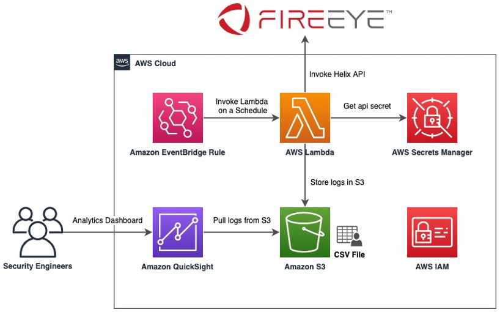
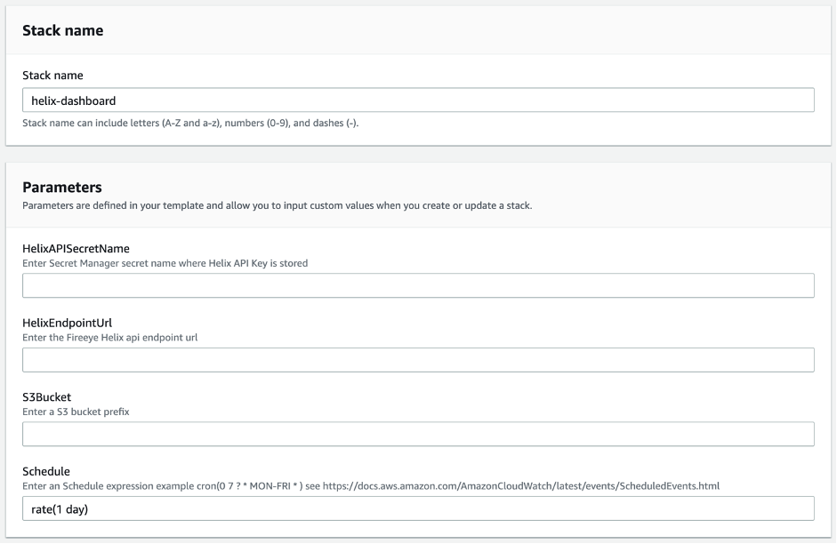

# AWS Blog: Creating Custom Analytics Dashboards with FireEye Helix and Amazon QuickSight

This repository contains sample code for the AWS Blog Post [Creating Custom Analytics Dashboards with FireEye Helix and Amazon QuickSight](https://aws.amazon.com/blogs/architecture/field-notes-creating-custom-analytics-dashboards-with-fireeye-helix-and-amazon-quicksight/). The solution allows you to create custom analytics dashboards with Amazon QuickSight on the threat detection logs collected by FireEye Helix.

## Solution Overview

The sample [CloudFormation template](helix-dashboard.yaml) provisions necessary AWS resources to ingest the FireEye Helix Security log data to a S3 bucket on a schedule. This includes an AWS Lambda function to call the FireEye Helix Search API, store the security log data on a S3 bucket, and Amazon EventBridge event rules to call the Lambda function on a given schedule.



## Deploy the solution

### Prerequisites

* [Create an AWS account](https://portal.aws.amazon.com/gp/aws/developer/registration/index.html) if you do not already have one and login.
* FireEye Helix search alerts API endpoint. This is available under the API documentation in the FireEye Helix console. 
* FireEye Helix API key. This [FireEye community](https://community.fireeye.com/s/article/000002504) page explains how to generate an API key with appropriate permissions (always follow least privilege principles). This key is used by the Lambda function to periodically fetch alerts. 
* AWS Secrets Manager secret (to store the FireEye Helix API key). To set it up, follow the steps outlined in the [Creating a secret](https://docs.aws.amazon.com/secretsmanager/latest/userguide/manage_create-basic-secret.html).

### Deploy the CloudFormation template

1. Clone the repo onto your local machine:
```
git clone https://github.com/aws-samples/aws-lambda-fireeye-helix-blog
```
2. Navigate to CloudFormation console and select [Create Stack](https://console.aws.amazon.com/cloudformation/home#/stacks/create/template)
3. Select `Upload a template file` radio button and click on `Choose file` button to open the file browser, navigate to aws-lambda-fireeye-helix-blog local github directory and select the `helix-dashboard.yaml` file
4. Enter the stack name and paramters as shown in below picture and click on `Next`
    * HelixAPISecretName – Enter the Secrets Manager secret name where the FireEye Helix API key is stored.
    * HelixEndpointUrl – Enter the Helix search API endpoint URL.
    * Amazon S3 bucket – Enter the bucket prefix (a random suffix will be added to make it unique).
    * Schedule – Choose the default option that pulls logs once a day, or enter the CloudWatch event schedule expression.



5. Select the check box next to “I acknowledge that AWS CloudFormation might create IAM resources.” and then click the `Create Stack` button
6. After the CloudFormation stack completes, you will have a fully functional process that will retrieve the FireEye Helix security log data and store it on the S3 bucket.

## Further Customization

You can also select the Lambda function from the CloudFormation stack Resources to navigate to the Lambda console. Review the sample code, and add any additional transformation logic according to your needs (line 36).

## Clean up

To avoid incurring future charges, delete the CloudFormation stack by navigating to [CloudFormation](https://console.aws.amazon.com/cloudformation/home) console and select the stack and click on Delete button.

## Security

See [CONTRIBUTING](CONTRIBUTING.md#security-issue-notifications) for more information.

## License

This library is licensed under the MIT-0 License. See the [LICENSE](LICENSE) file.
